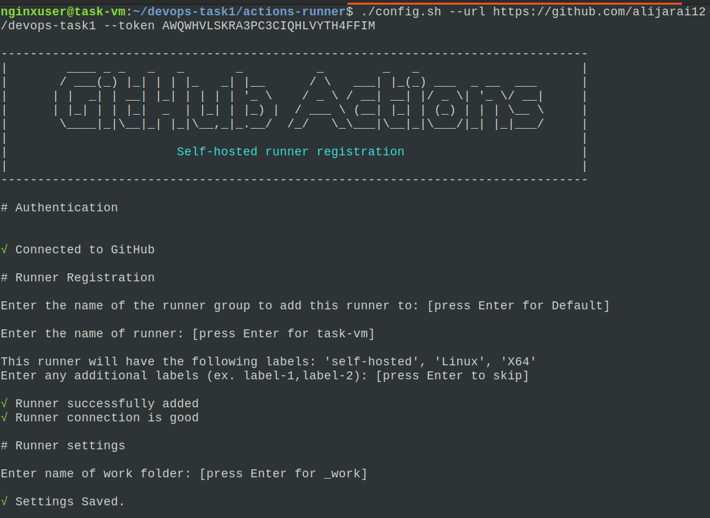
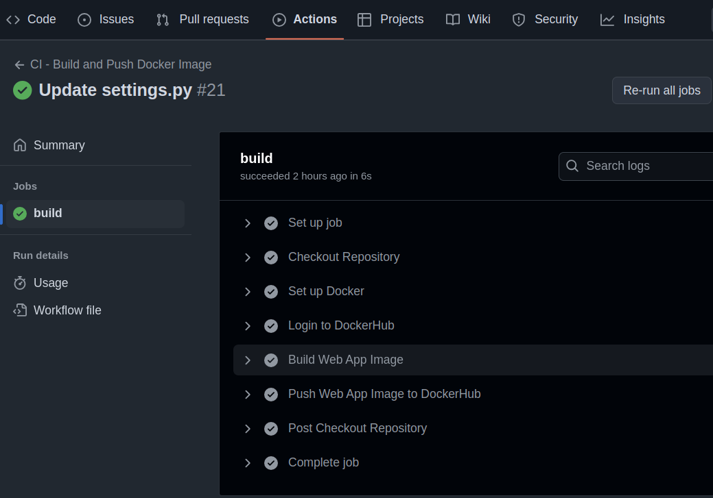
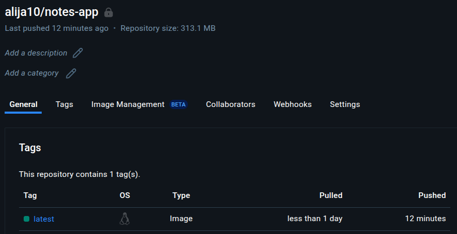
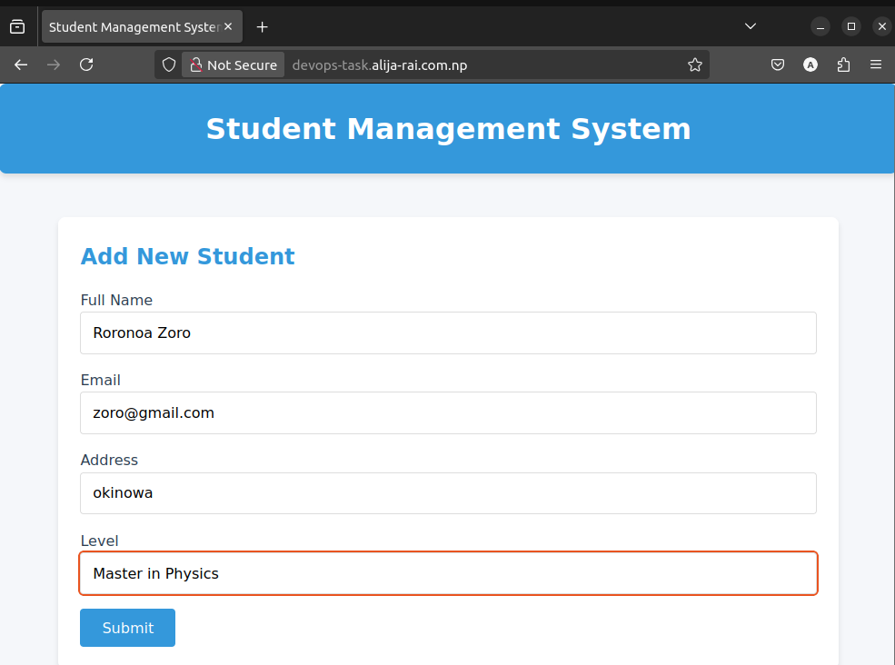
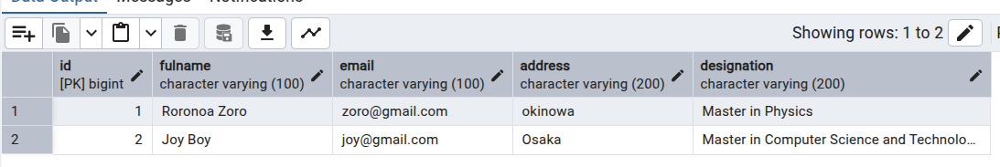

# CI/CD Deployment Task Using GitHub Runner


---

## Project Overview

This project demonstrates the setup of a CI/CD pipeline for a Django web application using:

- Django Backend (in Docker)

- HTML, CSS Frontend

- PostgreSQL Database & pgAdmin for management

- Nginx as a reverse proxy

- GitHub Actions with a self-hosted runner

The goal is to automate the deployment of a Django app with Docker and GitHub Actions.


---

## Server Setup

### Prerequisites:
- A Linux server (e.g., AWS EC2)
- **Docker**  & Nginx installed
- GitHub repository for the project
- DockerHub account (private repository for storing Docker images)
- **GitHub Actions Self-Hosted Runner** for CI/CD


### Setting up the server:
1. Clone this repository to your server:
   ```bash
   git clone git@github.com:alijarai12/ci-cd-github-runner.git
   cd ci-cd-github-runner

Run the setup-server.sh script to install and configure Docker and Nginx on your server:

    ```bash
    chmod +x setup-server.sh
    ./setup-server.sh

---

## GitHub Actions Configuration

Before triggering the CI/CD pipeline, ensure that a Self-Hosted Runner is set up on the server.


### Steps:
1. Go to **GitHub Repository → Settings → Actions → Runners**.
2. Add and follow the instructions to set up a Self-Hosted Runner.
3. Start the runner and ensure it is running in the background, ready to handle pipeline tasks.

Once set up, GitHub Actions will trigger CI/CD processes, including building Docker images and deploying the application.

---

## Dependency Setup (CI)

The **CI pipeline** includes the following steps:

1. Install dependencies: Install project dependencies (requirements.txt or pip).

2. Build Docker images: Build images using a Dockerfile for backend and any other necessary services.

3. Push to DockerHub: Push images to DockerHub (configure Docker credentials as GitHub secrets).

### Configure GitHub Secrets:
To securely push Docker images, configure GitHub secrets:
1. Go to **GitHub Repository → Settings → Secrets → Actions**.
2. Add the following secrets:
   - `DOCKER_USERNAME`
   - `DOCKER_PASSWORD`


### Create a DockerHub Access Token:
1. Go to **DockerHub → Account Settings → Security**.
2. Generate a new access token to use for authentication during the CI pipeline.

### CCI Workflow (.github/workflows/ci.yml):
Set up GitHub Actions to automate building and pushing Docker images.

---

## Project Setup (CD)

The CD pipeline pulls the latest Docker images from the Docker registry and deploys the application to the server.


### Steps:
1. Pull latest Docker images: Pull the latest Docker images from the registry.

2. Deploy application: Use Docker Compose to manage containers for the backend, database, and Nginx.


## Nginx Configuration 
Create a new Nginx configuration file for hosting the Django app. Ensure that it is configured correctly for reverse proxying and serving static files.


## Final Deployment

Ensure the GitHub Actions Self-Hosted Runner is running.

Trigger the pipeline by pushing changes to GitHub's master branch.


## Screenshots & Results

Screenshot of Self-Hosted Runner:



Screenshot of GitHub Actions CI/CD Pipeline:



Screenshot of Docker Private Registry in DockerHub:



Screenshot of Deployed Web Application:



Screenshot of Database with the Pgadmin:


